# InvoicePlane Invoice Management System - Complete Analysis

## 📋 Table of Contents

1. [System Overview](#system-overview)
2. [Application Features](#application-features)
3. [Database Architecture & Entity Relationships](#database-architecture--entity-relationships)
4. [Application Flow & User Journeys](#application-flow--user-journeys)
5. [Module Structure](#module-structure)
6. [API Architecture](#api-architecture)
7. [Integration Points](#integration-points)
8. [Technology Stack](#technology-stack)

---

## 1. System Overview

InvoicePlane is a comprehensive invoice management system designed to help businesses manage invoices, quotes, clients, payments, and financial reporting. The system supports the complete billing lifecycle from quote generation to payment collection.

### Core Purpose
- **Invoice Management**: Create, send, track, and manage professional invoices
- **Quote Management**: Generate quotes and convert them to invoices
- **Client Relationship Management**: Maintain detailed client records
- **Payment Tracking**: Record and track payments across multiple methods
- **Financial Reporting**: Generate insights on sales, payments, and aging

### System Architecture

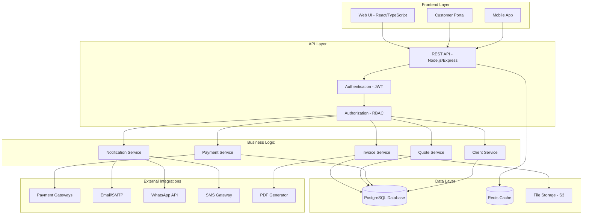

---

## 2. Application Features

### 2.1 User Management & Authentication

#### User Roles
- **Admin**: Full system access, user management, settings configuration
- **Staff**: Create/edit invoices, quotes, clients, record payments
- **Client**: Limited portal access for viewing invoices and quotes (via public links)

#### Authentication Features
- ✅ JWT-based authentication with refresh tokens
- ✅ Secure password hashing (bcrypt)
- ✅ Session management
- ✅ Login attempt tracking and rate limiting
- ✅ Password reset functionality
- ✅ Multi-user concurrent access

---

### 2.2 Client Management (CRM)

#### Core Features
- **Client Database**: Comprehensive client information storage
  - Personal details (name, surname, title)
  - Company information
  - Contact details (email, phone, fax, mobile, website)
  - Address information (address lines, city, state, zip, country)
  - Tax information (VAT ID, tax code)
  - Language preferences
  - Active/Inactive status

#### Advanced Features
- **Client Notes**: Add timestamped notes for each client
- **Client History**: View all invoices and transactions per client
- **User-Client Assignment**: Link staff users to specific clients
- **Client Filtering & Search**: Find clients quickly
- **Client Reports**: Sales by client, outstanding balances

#### Client Portal
- Token-based public access (no login required)
- View invoices and quotes
- Make payments online
- Download PDF documents
- View transaction history

---

### 2.3 Invoice Management

#### Invoice Lifecycle

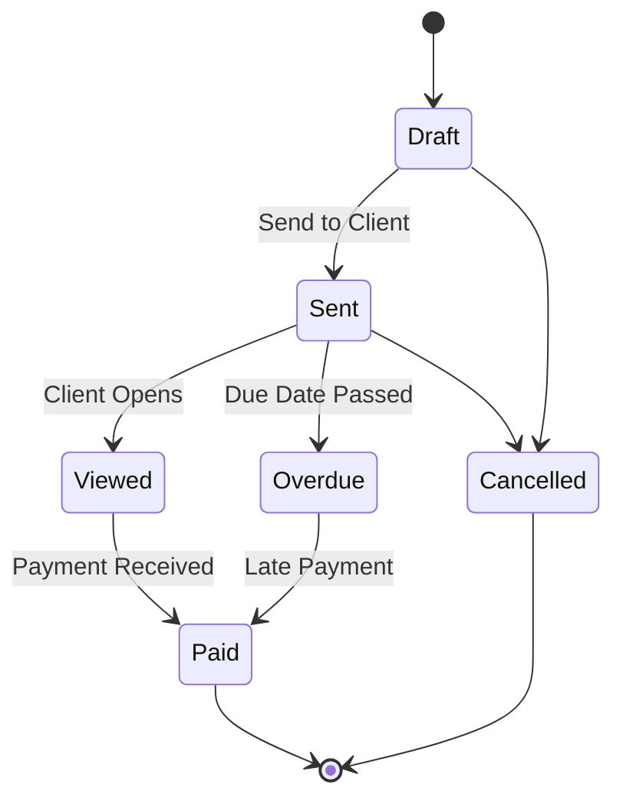

#### Core Invoice Features
- **Invoice Creation**: 
  - Select client
  - Add multiple line items (products/services)
  - Quantity, unit price, tax rates per item
  - Item-level discounts (percentage or fixed)
  - Invoice-level discounts
  - Automatic calculations (subtotal, tax, total)
  - Payment terms and notes
  - Custom fields support

- **Invoice Numbering**:
  - Auto-generated unique invoice numbers
  - Configurable invoice groups
  - Custom prefix support
  - Year/month inclusion options
  - Left-padding options

- **Invoice Operations**:
  - Draft creation and editing
  - Send via email
  - Generate PDF
  - Duplicate invoice
  - Mark as paid/cancelled
  - Delete (with restrictions)
  - Public URL with optional password protection

#### Recurring Invoices
- **Frequencies**: Daily, weekly, monthly, quarterly, yearly
- **Automation**: Automatic invoice generation
- **Settings**: Start date, end date, next generation date
- **Active/Inactive status**: Enable/disable recurring schedules

#### Invoice Items
- Link to product catalog (optional)
- Custom item names and descriptions
- Quantity and unit price
- Tax rate application
- Item sorting/ordering
- Automatic total calculations

---

### 2.4 Quote Management

#### Quote Features
- **Quote Creation**: Similar to invoices but for estimation
- **Quote Statuses**: Draft, Sent, Viewed, Approved, Rejected, Expired
- **Quote Operations**:
  - Create, edit, delete
  - Send to client via email
  - Generate PDF
  - Convert to invoice (one-click conversion)
  - Track expiry dates
  - Public URL access

#### Quote-to-Invoice Conversion
- Automatic creation of invoice from approved quote
- Maintains all line items, pricing, and client details
- Links quote to converted invoice
- Preserves quote for records

---

### 2.5 Payment Management

#### Payment Recording
- **Payment Methods**: 
  - Bank transfer
  - Cash
  - Check
  - Credit card
  - PayPal
  - Stripe
  - Custom payment methods

- **Payment Details**:
  - Amount
  - Payment date
  - Payment method
  - Reference number
  - Notes
  - Link to invoice

#### Payment Gateway Integration
- **Stripe Integration**: Online credit card payments
- **PayPal Integration**: PayPal payment processing
- **Gateway Logs**: Transaction tracking and debugging
- **Response data storage**: JSONB format for flexibility

#### Payment Tracking
- Automatic balance calculation
- Partial payment support
- Payment history per invoice
- Payment reminders
- Overdue tracking

---

### 2.6 Product & Service Catalog

#### Product Management
- **Product Information**:
  - Name and description
  - Price
  - Category assignment
  - Unit of measurement
  - Active/Inactive status

- **Product Categories**: Organize products hierarchically
- **Units**: Define measurement units (hours, pieces, kg, etc.)
- **Quick Add**: Add products directly from invoice creation

---

### 2.7 Tax Management

#### Tax Rates
- Multiple tax rate support
- Tax rate name and percentage
- Active/Inactive status
- Item-level tax application
- Automatic tax calculations
- Tax total reporting

---

### 2.8 Projects & Tasks

#### Project Management
- **Projects**: 
  - Link to clients
  - Project name and description
  - Status: Active, Completed, Cancelled
  - Created/updated timestamps

- **Tasks**:
  - Link to projects
  - Task name and description
  - Status: Pending, In Progress, Completed
  - Time tracking capability

---

### 2.9 Reporting & Analytics

#### Dashboard
- **Key Metrics**:
  - Total revenue
  - Outstanding amount
  - Paid invoices count
  - Overdue amount
  - Recent invoices
  - Recent payments
  - Top clients

- **Charts & Graphs**:
  - Revenue trends over time
  - Sales by client
  - Invoice status breakdown
  - Payment method distribution

#### Standard Reports
1. **Sales by Client Report**
   - Invoice count per client
   - Total sales
   - Paid amount
   - Outstanding balance

2. **Payment History Report**
   - All payments within date range
   - Payment methods breakdown
   - Total collected

3. **Invoice Aging Report**
   - Outstanding invoices by age
   - 1-15 days, 16-30 days, 31+ days
   - Total overdue per client

4. **Product Sales Report**
   - Most sold products
   - Revenue by product

---

### 2.10 Email & Notifications

#### Email System
- **Email Templates**: 
  - Invoice emails
  - Quote emails
  - Payment confirmation
  - Payment reminders
  - Custom templates

- **Email Features**:
  - HTML email support
  - Template variables (client name, invoice number, etc.)
  - PDF attachment
  - CC/BCC support
  - SMTP configuration
  - Email sending logs

#### Notification Types
- Invoice sent
- Invoice viewed
- Payment received
- Quote approved/rejected
- Invoice overdue reminders

---

### 2.11 File Management

#### Upload System
- **File Uploads**: Attach files to various entities
- **Supported Entities**: Clients, invoices, quotes, payments
- **File Information**: Name, path, size, mime type
- **Upload Tracking**: Who uploaded, when uploaded
- **Secure Storage**: AWS S3 or local storage

---

### 2.12 Settings & Configuration

#### System Settings
- **Company Information**: Name, logo, contact details
- **Currency Settings**: Default currency, symbol, format
- **Date Formats**: Customizable date display
- **Invoice Settings**:
  - Default due days
  - Default payment terms
  - Invoice footer text
  - Logo and branding

- **Email Settings**: SMTP configuration
- **Tax Settings**: Enable/disable tax system
- **Language Settings**: Multi-language support

#### Custom Fields
- **Flexible Data Model**: Add custom fields to:
  - Clients
  - Invoices
  - Quotes
  - Payments

- **Field Types**:
  - Text
  - Number
  - Date
  - Dropdown
  - Checkbox

---

### 2.13 Enhanced Features (Modernization Plan)

#### For Travel, Bus & Moving Services

**Service Type Management**
- Define service categories (travel, moving, bus, general)
- Pricing models (hourly, flat, distance-based, weight-based)
- Service-specific templates

**Route & Distance Tracking**
- Origin and destination addresses
- Distance calculation via Google Maps API
- Estimated vs actual duration
- Route optimization

**Vehicle Management**
- Vehicle database (trucks, vans, buses, cars)
- Capacity tracking
- Status management (available, in use, maintenance)
- License plate and insurance tracking
- Driver assignment

**Inventory Tracking** (for Moving Services)
- Item-by-item inventory
- Quantity and condition tracking
- Photo documentation
- Condition notes (good, fair, damaged)

**Passenger Management** (for Travel/Bus Services)
- Passenger details
- Seat assignments
- Pickup/dropoff locations
- Contact information

**Insurance & Liability**
- Insurance options catalog
- Coverage amounts
- Premium calculations
- Per-invoice insurance selection

**Booking System**
- Booking calendar
- Service reservations
- Booking statuses (pending, confirmed, completed, cancelled)
- Booking-to-invoice conversion

**WhatsApp Integration**
- Send invoices via WhatsApp
- Payment reminders
- Booking confirmations
- Status updates
- Using Twilio WhatsApp API

**SMS Notifications**
- Invoice notifications
- Payment confirmations
- Service reminders (24h before)
- Using Twilio SMS API

**Payment Links**
- Shareable payment URLs
- QR code generation
- Stripe Checkout integration
- PayPal payment links
- Expirable links
- Public payment page

**Real-time Tracking**
- WebSocket-based live tracking
- Driver location updates
- Customer tracking portal
- ETA calculations
- Google Maps integration

**Multi-currency Support**
- Multiple currency definitions
- Exchange rate tracking
- Per-invoice currency selection
- Automatic conversion

---

## 3. Database Architecture & Entity Relationships

### 3.1 Database Schema Overview

The InvoicePlane system uses **21 core tables** organized into logical groups:

#### Table Groups
1. **Authentication & Users** (3 tables)
2. **Clients** (3 tables)
3. **Products & Services** (3 tables)
4. **Tax Management** (1 table)
5. **Invoice System** (4 tables)
6. **Quote System** (2 tables)
7. **Payment System** (3 tables)
8. **Projects & Tasks** (2 tables)
9. **Configuration** (5 tables)
10. **File Management** (1 table)

### 3.2 Entity Relationship Diagram

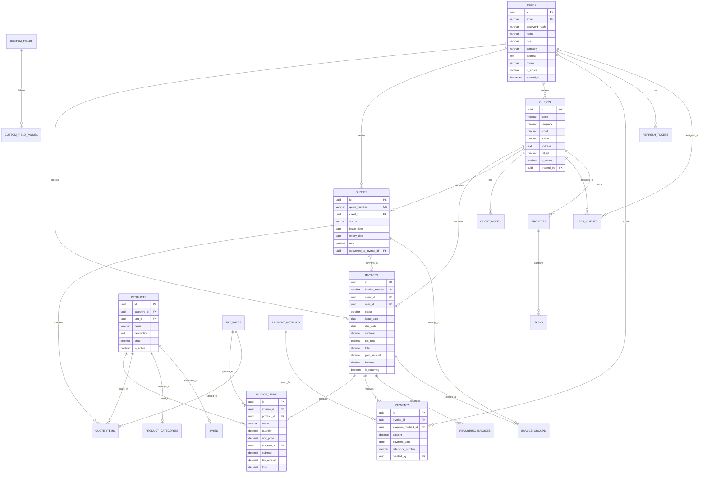

### 3.3 Key Relationships Explained

#### 1. User → Invoices/Quotes (One-to-Many)
- One user can create multiple invoices and quotes
- Tracks ownership and responsibility
- Used for filtering and permissions

#### 2. Client → Invoices/Quotes (One-to-Many)
- One client can have multiple invoices and quotes
- Core business relationship
- Enables client history and reporting

#### 3. Invoice → Invoice Items (One-to-Many)
- One invoice contains multiple line items
- Cascade delete: Deleting invoice removes all items
- Items store product reference but maintain data integrity if product is deleted

#### 4. Invoice → Payments (One-to-Many)
- One invoice can receive multiple payments
- Supports partial payments
- Automatic balance calculation

#### 5. Quote → Invoice (One-to-One)
- Optional conversion relationship
- Quote tracks which invoice it converted to
- Prevents duplicate conversions

#### 6. Product → Invoice Items (One-to-Many)
- Product is a template for invoice items
- Item maintains product reference but stores snapshot of data
- Allows product price changes without affecting historical invoices

#### 7. Users ↔ Clients (Many-to-Many)
- Via `user_clients` junction table
- Allows assigning staff to specific clients
- Useful for client territory management

#### 8. Recurring Invoice → Invoice (One-to-Many)
- Recurring template generates multiple invoices
- Tracks next generation date
- Frequency settings (daily, weekly, monthly, etc.)

### 3.4 Data Integrity & Constraints

#### Cascade Rules
- **ON DELETE CASCADE**: 
  - `invoice_items` when invoice deleted
  - `quote_items` when quote deleted
  - `client_notes` when client deleted
  - `refresh_tokens` when user deleted

- **ON DELETE RESTRICT**:
  - Cannot delete client with invoices
  - Cannot delete user with invoices
  - Protects financial records integrity

- **ON DELETE SET NULL**:
  - Product deletion doesn't affect invoice items
  - Tax rate deletion preserves historical data

#### Check Constraints
- **User roles**: Must be 'admin', 'staff', or 'client'
- **Invoice status**: Draft, sent, viewed, paid, overdue, cancelled
- **Quote status**: Draft, sent, viewed, approved, rejected, expired
- **Discount types**: Percentage or fixed
- **Project/Task statuses**: Validated enum values

#### Unique Constraints
- Email addresses (users)
- Invoice numbers
- Quote numbers
- URL keys for public access

### 3.5 Indexes for Performance

```sql
-- Invoice lookup optimization
CREATE INDEX idx_invoices_client ON invoices(client_id);
CREATE INDEX idx_invoices_status ON invoices(status);
CREATE INDEX idx_invoices_dates ON invoices(issue_date, due_date);

-- Payment queries
CREATE INDEX idx_payments_invoice ON payments(invoice_id);
CREATE INDEX idx_payments_date ON payments(payment_date);

-- Quote lookup
CREATE INDEX idx_quotes_client ON quotes(client_id);
CREATE INDEX idx_quotes_status ON quotes(status);

-- User queries
CREATE INDEX idx_users_email ON users(email);
CREATE INDEX idx_users_role ON users(role);

-- Client filtering
CREATE INDEX idx_clients_active ON clients(is_active);
```

---

## 4. Application Flow & User Journeys

### 4.1 Complete Business Process Flow

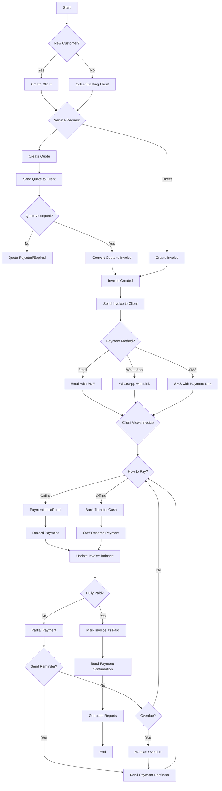

### 4.2 User Journey: Admin Creating Invoice

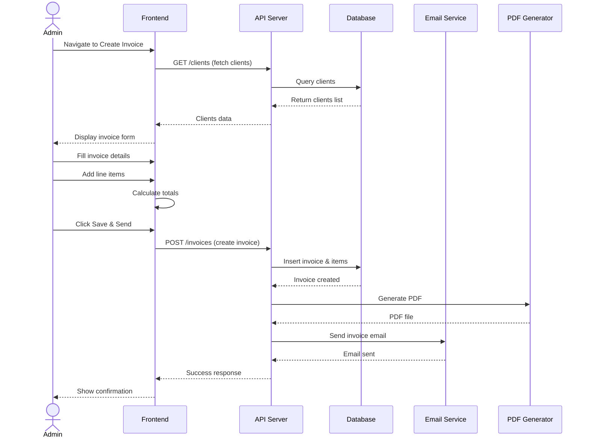

### 4.3 User Journey: Client Paying Invoice

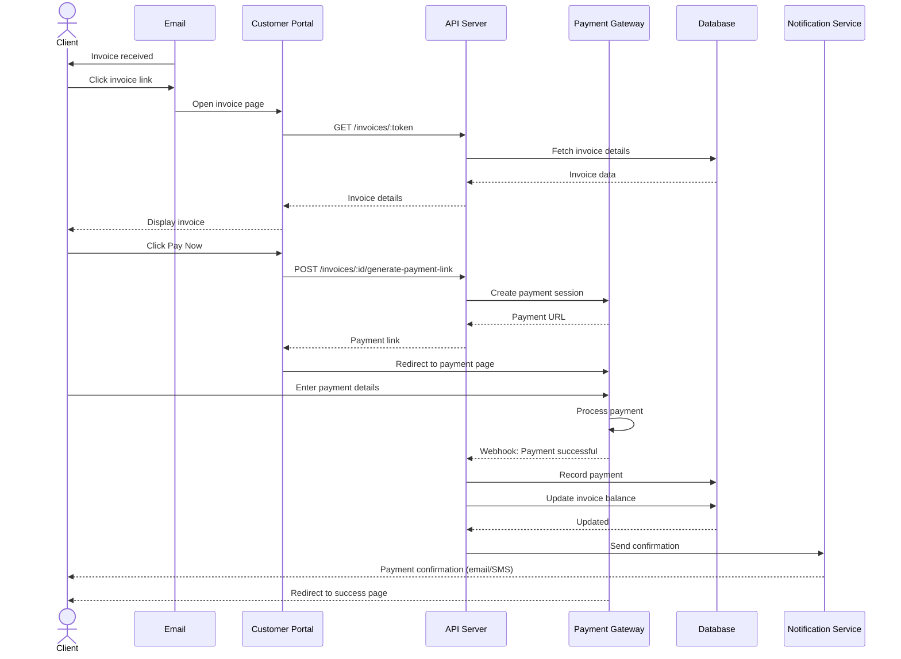

### 4.4 Automated Process: Recurring Invoice Generation

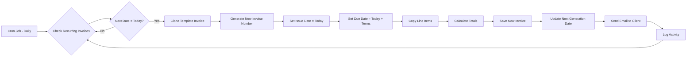

### 4.5 Payment Processing Flow

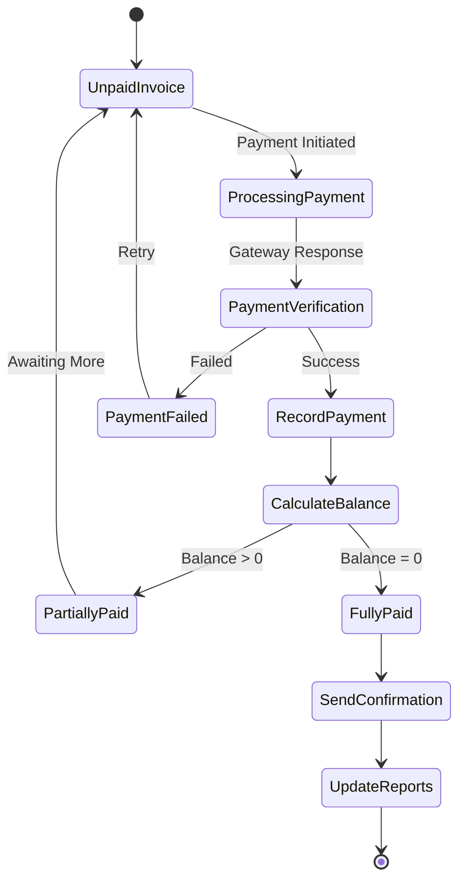

---

## 5. Module Structure

The InvoicePlane system is organized into **29 functional modules** within the CodeIgniter framework:

### 5.1 Core Modules

| Module | Purpose | Key Features |
|--------|---------|--------------|
| **dashboard** | Main dashboard | Revenue metrics, charts, recent activity |
| **sessions** | Authentication | Login, logout, session management |
| **users** | User management | CRUD operations, role management |
| **settings** | System configuration | Company info, email, tax, general settings |

### 5.2 Client Management Modules

| Module | Purpose | Key Features |
|--------|---------|--------------|
| **clients** | Client database | Client CRUD, search, filtering |
| **user_clients** | Client assignments | Link staff to clients |
| **custom_values** | Custom field values | Store custom field data for clients |

### 5.3 Financial Modules

| Module | Purpose | Key Features |
|--------|---------|--------------|
| **invoices** | Invoice management | Create, edit, send, track invoices |
| **invoice_groups** | Invoice numbering | Configure invoice number formats |
| **quotes** | Quote management | Create, send, convert quotes |
| **payments** | Payment tracking | Record, view, manage payments |
| **payment_methods** | Payment options | Define payment methods |

### 5.4 Product Modules

| Module | Purpose | Key Features |
|--------|---------|--------------|
| **products** | Product catalog | Product CRUD, pricing |
| **families** | Product categories | Organize products |
| **units** | Measurement units | Define units (hours, kg, etc.) |
| **tax_rates** | Tax rates | Manage tax percentages |

### 5.5 Project Modules

| Module | Purpose | Key Features |
|--------|---------|--------------|
| **projects** | Project management | Link projects to clients |
| **tasks** | Task tracking | Project task management |

### 5.6 Reporting Modules

| Module | Purpose | Key Features |
|--------|---------|--------------|
| **reports** | Financial reports | Sales, payments, aging reports |

### 5.7 Communication Modules

| Module | Purpose | Key Features |
|--------|---------|--------------|
| **email_templates** | Email templates | Customizable email content |
| **mailer** | Email sending | SMTP integration, email queue |

### 5.8 Utility Modules

| Module | Purpose | Key Features |
|--------|---------|--------------|
| **upload** | File uploads | Handle file attachments |
| **import** | Data import | Import clients, products, invoices |
| **filter** | Data filtering | Advanced search and filters |
| **layout** | UI components | Headers, footers, navigation |

### 5.9 Setup & Guest Modules

| Module | Purpose | Key Features |
|--------|---------|--------------|
| **setup** | Installation wizard | Database setup, initial config |
| **guest** | Public access | Client portal, invoice viewing |
| **welcome** | Landing page | Welcome screen |

### 5.10 Extension Modules

| Module | Purpose | Key Features |
|--------|---------|--------------|
| **custom_fields** | Custom fields | Define custom fields for entities |

### 5.11 Module Interaction Map

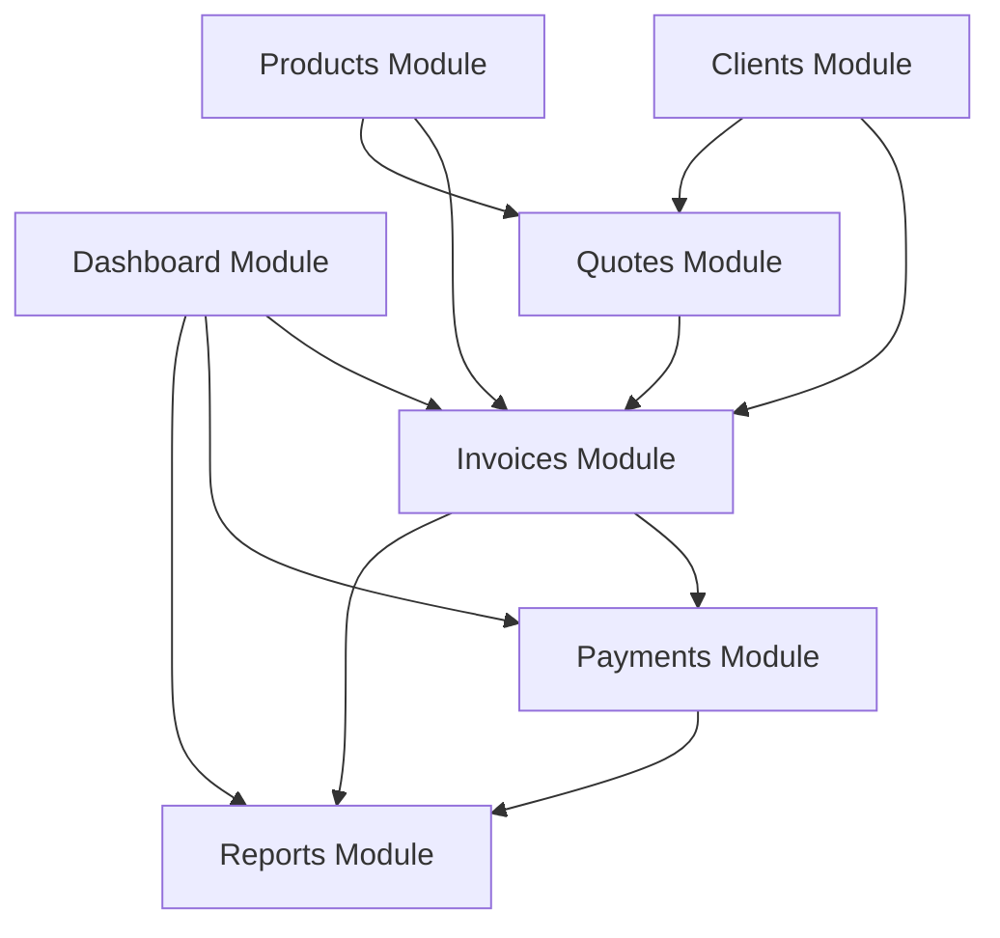

---

## 6. API Architecture

### 6.1 REST API Endpoints (9 Major Groups)

#### 1. Authentication Endpoints
```
POST   /auth/register          - Register new user
POST   /auth/login             - User login
POST   /auth/refresh           - Refresh access token
POST   /auth/logout            - Logout user
```

#### 2. Client Endpoints
```
GET    /clients                - List all clients (paginated, filtered)
GET    /clients/:id            - Get client details
POST   /clients                - Create new client
PUT    /clients/:id            - Update client
DELETE /clients/:id            - Delete client
GET    /clients/:id/invoices   - Get client invoices
GET    /clients/:id/notes      - Get client notes
POST   /clients/:id/notes      - Add client note
```

#### 3. Invoice Endpoints
```
GET    /invoices               - List all invoices (paginated, filtered)
GET    /invoices/:id           - Get invoice with items
POST   /invoices               - Create new invoice
PUT    /invoices/:id           - Update invoice
DELETE /invoices/:id           - Delete invoice
PATCH  /invoices/:id/status    - Update invoice status
POST   /invoices/:id/send      - Send invoice via email
GET    /invoices/:id/pdf       - Download invoice PDF
POST   /invoices/:id/duplicate - Duplicate invoice
```

#### 4. Quote Endpoints
```
GET    /quotes                 - List all quotes
GET    /quotes/:id             - Get quote details
POST   /quotes                 - Create new quote
PUT    /quotes/:id             - Update quote
DELETE /quotes/:id             - Delete quote
POST   /quotes/:id/convert     - Convert quote to invoice
POST   /quotes/:id/send        - Send quote via email
GET    /quotes/:id/pdf         - Download quote PDF
```

#### 5. Payment Endpoints
```
GET    /payments               - List all payments
GET    /payments/:id           - Get payment details
POST   /payments               - Record new payment
PUT    /payments/:id           - Update payment
DELETE /payments/:id           - Delete payment
```

#### 6. Product Endpoints
```
GET    /products               - List all products
GET    /products/:id           - Get product details
POST   /products               - Create new product
PUT    /products/:id           - Update product
DELETE /products/:id           - Delete product
```

#### 7. Report Endpoints
```
GET    /reports/dashboard           - Dashboard summary
GET    /reports/sales-by-client     - Sales by client report
GET    /reports/payment-history     - Payment history report
GET    /reports/invoice-aging       - Invoice aging report
```

#### 8. Settings Endpoints
```
GET    /settings               - Get all settings
PUT    /settings               - Update settings
```

#### 9. User Management Endpoints
```
GET    /users                  - List all users (admin only)
GET    /users/:id              - Get user profile
PUT    /users/:id              - Update user
DELETE /users/:id              - Delete user
```

### 6.2 API Response Format

**Success Response:**
```json
{
  "success": true,
  "data": {
    // Response data
  }
}
```

**Error Response:**
```json
{
  "success": false,
  "error": {
    "code": "VALIDATION_ERROR",
    "message": "Validation failed",
    "details": [
      {
        "field": "email",
        "message": "Email is required"
      }
    ]
  }
}
```

### 6.3 API Authentication Flow

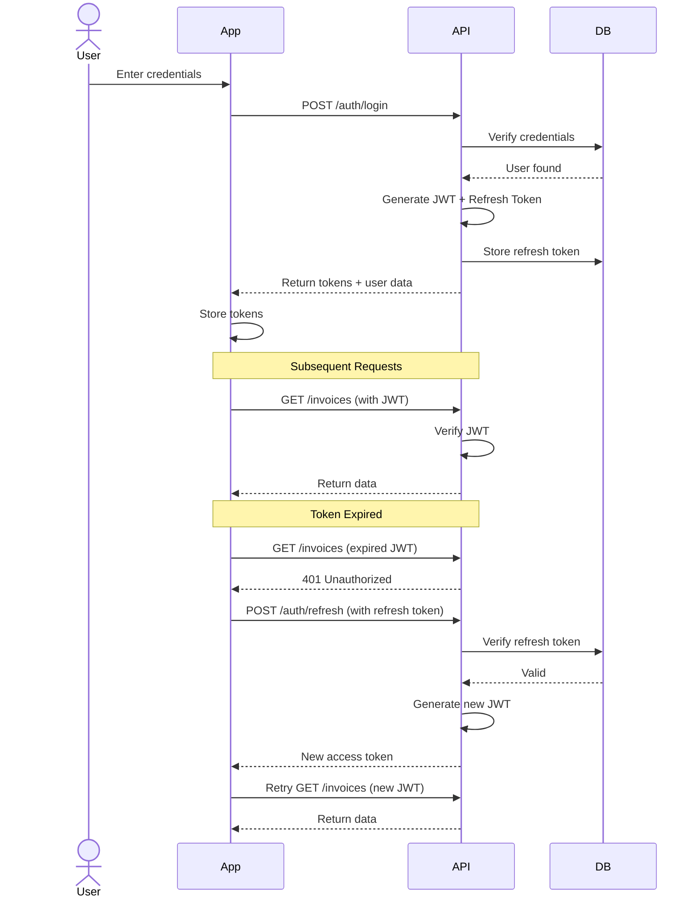

### 6.4 Data Flow Architecture

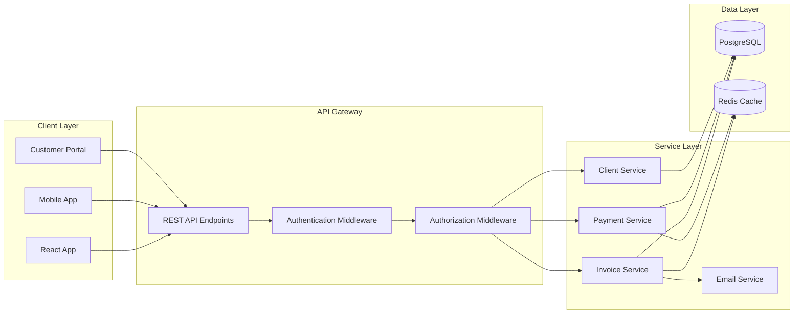

---

## 7. Integration Points

### 7.1 Payment Gateway Integrations

#### Stripe Integration
```typescript
// Payment flow
1. Create payment intent
2. Client confirms payment
3. Webhook receives confirmation
4. Record payment in system
5. Update invoice balance
6. Send confirmation email

// Features
- Credit card payments
- Payment links
- Subscription billing (for recurring invoices)
- Refund support
- Transaction logs
```

#### PayPal Integration
```typescript
// Payment flow
1. Generate PayPal payment link
2. Redirect client to PayPal
3. PayPal processes payment
4. IPN (Instant Payment Notification) callback
5. Verify payment
6. Record in system

// Features
- PayPal checkout
- PayPal subscriptions
- Invoice-based payments
```

### 7.2 Email Service Integration

#### SMTP Configuration
```yaml
Email Settings:
  - SMTP host & port
  - Username & password
  - Encryption (TLS/SSL)
  - From address & name
  - Reply-to address
```

#### Email Templates
- Invoice email with PDF attachment
- Quote email
- Payment confirmation
- Payment reminder
- Overdue notice
- Welcome email

### 7.3 WhatsApp Integration (Modernization)

```typescript
// Twilio WhatsApp API
Features:
  - Send invoice PDFs via WhatsApp
  - Payment reminders
  - Booking confirmations
  - Status updates
  - Two-way messaging support

Implementation:
  POST /invoices/:id/send-whatsapp
  {
    "phoneNumber": "+1234567890",
    "message": "Optional custom message"
  }
```

### 7.4 SMS Integration (Modernization)

```typescript
// Twilio SMS API
Features:
  - Invoice notifications
  - Payment confirmations
  - Booking reminders
  - Status updates
  - Overdue alerts

Implementation:
  POST /invoices/:id/send-sms
  {
    "phoneNumber": "+1234567890",
    "message": "Custom SMS text"
  }
```

### 7.5 Google Maps API Integration (Modernization)

```typescript
// For distance & route tracking
Features:
  - Calculate distance between addresses
  - Estimate travel time
  - Route optimization
  - Real-time tracking
  - Geocoding addresses

API Calls:
  - Distance Matrix API
  - Directions API
  - Geocoding API
  - Maps JavaScript API (for display)
```

### 7.6 PDF Generation

```typescript
// Libraries
- React-PDF (frontend preview)
- PDFKit or Puppeteer (backend generation)

Features:
  - Branded invoice templates
  - Custom logo & colors
  - Multi-page support
  - Itemized billing
  - Tax breakdowns
  - Payment instructions
```

### 7.7 File Storage Integration

```typescript
// AWS S3 or Local Storage
Features:
  - File uploads (images, documents)
  - Secure signed URLs
  - Automatic cleanup of temp files
  - File type validation
  - Size limits enforcement

Entities supporting uploads:
  - Clients (documents, contracts)
  - Invoices (supporting documents)
  - Quotes (proposals, specs)
  - Products (images)
```

### 7.8 Third-Party Integration Summary

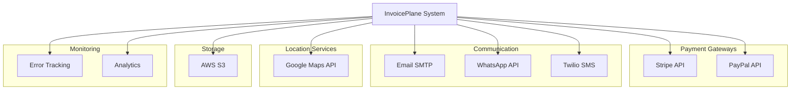

---

## 8. Technology Stack

### 8.1 Current System (PHP-based)

#### Backend
- **Framework**: CodeIgniter 3.x (PHP MVC framework)
- **Language**: PHP 7.4+
- **Database**: MySQL 5.7+ or MariaDB
- **PDF**: mPDF library
- **Email**: PHPMailer

#### Frontend
- **Views**: PHP templates (CodeIgniter views)
- **CSS**: Bootstrap 3.x
- **JavaScript**: jQuery
- **Charts**: Chart.js

#### Server Requirements
- Apache/Nginx web server
- PHP with extensions (mysqli, gd, mbstring, etc.)
- MySQL/MariaDB database
- mod_rewrite enabled

### 8.2 Modernized System (Planned)

#### Frontend Stack
```yaml
Core:
  - React 18+ with TypeScript
  - Vite (build tool)
  
Routing:
  - React Router v6
  
State Management:
  - Zustand (global state)
  - TanStack Query / React Query (server state)
  
UI Framework:
  - Tailwind CSS
  - Shadcn/ui components
  
Form Management:
  - React Hook Form
  - Zod (validation)
  
Charts & Visualization:
  - Recharts
  - React-Chartjs-2
  
PDF Generation:
  - React-PDF
  
HTTP Client:
  - Axios
```

#### Backend Stack
```yaml
Runtime:
  - Node.js 20+
  - TypeScript
  
Framework:
  - Express.js
  
ORM:
  - Prisma
  
Authentication:
  - JSON Web Token (JWT)
  - bcrypt (password hashing)
  
Job Queue:
  - Bull (Redis-based)
  
Caching:
  - Redis
  
Email:
  - Nodemailer
  
PDF:
  - PDFKit or Puppeteer
  
Validation:
  - Zod
  
Testing:
  - Jest (unit tests)
  - Supertest (integration tests)
  - Playwright (E2E tests)
```

#### Database Stack
```yaml
Primary Database:
  - PostgreSQL 15+
  
Features Used:
  - UUID primary keys
  - JSONB columns for flexible data
  - Advanced indexing
  - Full-text search
  - Triggers for automation
  
Cache:
  - Redis 7+
  
File Storage:
  - AWS S3 or DigitalOcean Spaces
```

#### DevOps Stack
```yaml
Containerization:
  - Docker
  - Docker Compose
  
CI/CD:
  - GitHub Actions
  
Hosting:
  - AWS (EC2, RDS, S3)
  - DigitalOcean Droplets
  - Vercel (frontend)
  
Reverse Proxy:
  - Nginx
  
SSL:
  - Let's Encrypt (certbot)
  
Monitoring:
  - Sentry (error tracking)
  - New Relic (performance)
  - UptimeRobot (uptime monitoring)
  
Logging:
  - Winston (application logs)
  - Morgan (HTTP logs)
```

### 8.3 Technology Comparison

| Aspect | Current (PHP) | Modernized (Node.js) |
|--------|---------------|----------------------|
| **Language** | PHP | TypeScript/JavaScript |
| **Framework** | CodeIgniter | Express + React |
| **Database** | MySQL | PostgreSQL |
| **State Management** | Session-based | JWT + React Query |
| **UI Framework** | Bootstrap 3 + jQuery | Tailwind + React |
| **API Style** | Server-rendered pages | RESTful API + SPA |
| **Real-time** | Not supported | WebSockets (Socket.io) |
| **Type Safety** | Limited | Full TypeScript support |
| **Testing** | Manual | Automated (Jest, Playwright) |
| **Scalability** | Vertical | Horizontal + Vertical |
| **Performance** | Good | Excellent |
| **Developer Experience** | Moderate | Excellent |

---

## 9. Summary & Key Takeaways

### System Capabilities

✅ **Complete Invoice Management**
- Draft → Send → Track → Paid lifecycle
- Recurring invoice automation
- Multiple payment methods
- Partial payment support

✅ **Client Relationship Management**
- Comprehensive client database
- Client notes and history
- User-client assignments
- Client portal access

✅ **Quote to Invoice Workflow**
- Professional quote generation
- Quote approval tracking
- One-click conversion to invoice

✅ **Financial Reporting**
- Dashboard with key metrics
- Sales by client reports
- Payment history tracking
- Invoice aging analysis

✅ **Flexible Product Catalog**
- Products with categories
- Multiple units of measurement
- Tax rate management

✅ **Multi-channel Communication**
- Email with SMTP
- WhatsApp integration (planned)
- SMS notifications (planned)
- PDF generation

✅ **Payment Processing**
- Stripe integration
- PayPal support
- Payment links
- Online customer portal

### Database Structure

- **21 core tables** with proper relationships
- **UUID primary keys** for scalability
- **Referential integrity** with cascade rules
- **Performance indexes** on key columns
- **Extensible** with custom fields

### API Design

- **9 major endpoint groups** covering all functionality
- **RESTful architecture** with standard HTTP methods
- **JWT authentication** with refresh tokens
- **Pagination, filtering, and search** on list endpoints
- **Consistent response format** across all endpoints

### Future Enhancements

🚀 **Service Business Features**
- Route and distance tracking
- Vehicle management
- Passenger/inventory tracking
- Booking system
- Real-time tracking

🚀 **Communication Enhancements**
- WhatsApp business API
- SMS notifications
- Push notifications
- Real-time updates

🚀 **Advanced Features**
- Multi-currency support
- Multi-language interface
- Advanced analytics
- Mobile apps
- API for third-party integrations

---

## 📚 Related Documentation

For detailed implementation information, refer to:

1. **[1_DATABASE_SCHEMA.sql](file:///d:/projects/InvoicePlane/1_DATABASE_SCHEMA.sql)** - Complete PostgreSQL schema
2. **[2_REST_API_DESIGN.md](file:///d:/projects/InvoicePlane/2_REST_API_DESIGN.md)** - Full API specification
3. **[3_REACT_FRONTEND_STRUCTURE.md](file:///d:/projects/InvoicePlane/3_REACT_FRONTEND_STRUCTURE.md)** - Frontend architecture
4. **[MODERNIZATION_SUMMARY.md](file:///d:/projects/InvoicePlane/MODERNIZATION_SUMMARY.md)** - Modernization roadmap

---

*This analysis document provides a comprehensive overview of the InvoicePlane invoice management system, covering all aspects from features and database design to application flow and integration points.*
